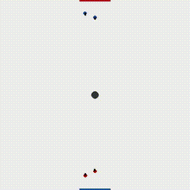

# AI 394D - Final Project - Group 46

Below you will see example videos of how our model (state agent) performs against the other agents supplied by the TAs and Professor. Note the following:
- Each match runs for a maximum of 1000 frames.
- For all games, the puck starts at location (0, 0) with a starting velocity of (0, 0).
- The matches are separated into two categories:
    - those in which our model played as BLUE (starts at the top)
    - those in which our model played as RED (starts at the bottom)
- The title above each video is the name of the opponent agent we are playing against.

## Our model is BLUE

### AI

### Geoffrey
_

### Image Jurgen

### Jurgen

### Yann

### Yoshua

## Our model is RED

### AI

### Geoffrey

### Image Jurgen

### Jurgen

### Yann

### Yoshua

